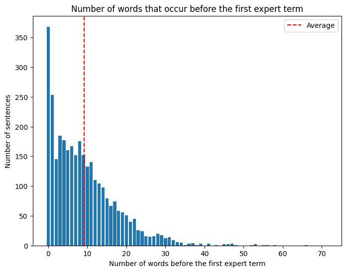

# CS 136 Final Project Report
Bill Xia 
Tufts University 
`wxia01@tufts.edu`

## 1. Introduction
Our goal is to develop a prediction model that is able to read sentences from biomedical abstracts as its input and output lists of labels identifying each word in the sentence as either part of an expert term (non-consumer biomedical term) or not part of an expert term. 

The primary application for this model is text simplification, where separate models could provide definitions for identified terms, thereby making complex literature more accessible to readers without biomedical backgrounds.

We believe that probabilistic modeling will be useful for this task because such an approach leverages probabilities associated with prior text contexts to predict future labels. Additionally, a probabilistic model offers better performance than simple point-estimate models while avoiding the intensive computational costs associated with state-of-the-art transformer-based models. 

## 2. Data & Analysis Plan
Our data is derived from the <a href="https://bionlp.nlm.nih.gov/plaba2023/">PLABA dataset</a> [1], a collection of biomedical paper abstracts. Last summer, I annotated the data by constructing Beginning-Inside-Outside label sequences for each sentence. That is, each word in each sentence was labeled either B (beginning of an expert term), I (inside an expert term), or O (outside an expert term). The following is an example observation-label pair as it would be seen in the training data:

`Quinine sulfate is an antimalarial drug.` 
`B_______I_______O__O__O____________O____`

Inputs to the model take the form of individual sentences (strings) and outputs take the form of label lists, where each label corresponds to a single word in the sentence. The model predicts labels one at a time, starting by predicting the first label using just the associated word, then by predicting subsequent labels using prior word-label pairs. Using Figure 1 as an example, the label for “Quinine” would be predicted with just the word “Quinine”, but the next label would be predicted using both the word “sulfate” as well as word/label data associated with “Quinine.”

In total, there are 7606 sentence-label-list pairs. There are 3201 sentences (42.09% of the total data) that contain expert terms (B in the label list). Of those sentences, there are 1356 (42.36% of the sentences with expert terms, 17.83% of the total data) that contain expert terms consisting of more than 1 word (I in the label list).

### 2.1 Necessary Pre-Processing
The data requires very little pre-processing. Input sentences must be stripped of all punctuation and have all their characters set to lowercase. Additionally, each sentence must be split into lists of words for the model to predict labels for each word one at a time. 

### 2.2 Visualizing the Data
Because our model will predict word labels according to prior words and labels in a given sentence, it is important to understand how much context (that is, how many words) we are shown before expert terms occur in each sentence. The number of words that occur before every expert term will tell us how much information our model can use to make each prediction. 

On average, 9.114 non-expert terms appear before the first expert term, meaning that context can often be used to predict expert terms. However, 368 sentences (11.5%) begin with an expert term, meaning that for a non-significant number of sentences, we won’t have any context to predict the first expert term. As such, we must find a way of forming accurate predictions for the labels of words that occur at the very beginning of sentences. 

### 2.3 Experimental Protocol
Our data will be shuffled and partitioned into training and testing sets according to an 85 : 15 ratio. They will have 6465 and 1141 sentence-label pairs respectively. We believe that such a split is reasonable because the model will require as much training data as possible to build a substantive vocabulary. 

In addition to training and testing our models on shuffled data, we will also evaluate our model’s performance on unshuffled data, where sentences covering similar topics will be grouped closer to one another. This data set will be partitioned with the same ratio as the data set above. We will use this data set to evaluate our model’s performance on words not seen in the training data. 

We will evaluate the performance of our models based on how often they can correctly label individual words in sentences in our test set. Specifically, we plan on using precision, recall, and F1 score to measure model performance. Precision will measure what percentage of the expert terms labeled by our models are actual expert terms, and recall will measure what percentage of actual expert terms our models are able to catch. Together, they form the F1 score, an average between precision and recall for a more general metric of our models’ performances.

## 3. Baseline Method
For our baseline model, we will make a Markov assumption and say that each label’s value is dependent on the previous label’s value. We’ll also make use of the current word (associated with the predicted label) to make our predictions. 

This model takes the form of a Categorical PMF that predicts random variable $l_t$ given either parameter $\zeta$ or parameter $\eta$. 
- lt is a discrete integer representing the $t$-th label in the sentence. It has a sample space of {0, 1, 2}, which has size L=3. 
- $\zeta$ and $\eta$ are arrays of dimension V * L and L * V * L respectively, where V is the size of our model’s vocabulary––a list of unique words that our model has been trained to recognize plus a wildcard to represent words not seen in the training data. 
- We use parameter $\zeta_v$ when predicting the first label in a given sentence. We choose $\zeta_v$ by indexing into $\zeta$ using $w_t$, the integer representation of the first word in the sentence. $\zeta$ maps integer representations of words to probability vectors for the possible labels associated with those words. 
- We use parameter ηmv when predicting all labels beyond the first in a given sentence. We choose ηmv by indexing into $\eta$ using $l_{t-1}$ and $w_t$, the integer representations of the previous label and the current word respectively. $\eta$ maps integer representations of prev-label, curr-word combinations to probability vectors for the possible labels associated with those combinations. 

$\zeta_v$ and $\eta_{mv}$ are both probability vectors of size L=3 and are bound by the following constraints:
- All elements in both vectors must be greater than 0. 
- The elements of the vectors must both sum to 1. 

So, the likelihood function used to predict the label of the first word in a sentence looks like this:

$$\text{CatPMF}(l_t \mid \zeta_v)=\prod^L_{l=1}\zeta^{[l_t=l]}_{vl}$$

The likelihood function used to predict the labels of all other words in a sentence looks like this:

$$\text{CatPMF}(l_t \mid \eta_{mv})=\prod^L_{l=1}\eta^{[l_t=l]}_{mvl}$$

### 3.1 Estimation
We perform label predictions using maximum likelihood. For each word, we will index into either $\zeta$ or $\eta$ to get $\zeta_v$ or $\eta_{mv}$. We then use that probability vector as the parameter for our Categorical likelihood function. Maximizing the likelihood function over all values in the label set will yield our prediction for lt. 

$$l_t=\text{argmax}_{l\in L} \text{CatPMF}(l \mid \eta[l_{t-1}, w_t])$$

### 3.2 Implementation
Our baseline model was simple enough for us to implement entirely from scratch, using the numpy [2] library’s argmax function to perform maximization. 

Training the baseline begins with building a vocabulary of unique words using the sentences found in the training data. Next, two count tables were initialized with pseudocounts of 1, then filled to record how many times each label occurred in a specific context. In the last step of training, the count tables were used to construct frequency tables $\zeta$ and $\eta$.

Prediction for the baseline was implemented according to the Categorical PMFs and estimation formula described above. 

## 4. Proposed Upgrade Method
While our baseline is able to use prior word-label data to predict later labels in sentences, its context window is still quite small. As a result, the baseline isn’t making use of all the information it has access to when making predictions. Extra context may allow the model to identify different ways that the same word could be used in a sentence or recognize that certain words only get marked as expert terms when they appear next to a certain other word. 

Our upgrade expanded the model’s context window to predict using not just the current word and previous label, but also the previous word. We hypothesize that compared to the baseline, our upgrade should improve prediction accuracy on our dataset, especially when labeling words with ambiguous meanings, because of the upgrade’s improved ability to utilize contextual data. 

## 5. Results & Analysis
We evaluated our baseline and upgraded models on both the shuffled and unshuffled data sets. In the shuffled data set, around 6.19% of the words encountered were entirely new to our models. In the unshuffled data set, around 11.33% of the encountered words were new. In all of our tests, we measured the number of true positive, false positive, true negative, and false negative labels that were assigned, where “B” and “I” were considered positive labels and “O” was considered a negative label. Here is a visualization of our models’ performances:

In all four experiments, the models scored higher on precision than recall, meaning that they had low false positive rates but high false negative rates when identifying expert terms. In almost all metrics, the upgrade performed worse than the baseline. The results suggest that adding previous words to our context window decreases model accuracy instead of increasing accuracy like we predicted. 

The overall drop in performance may indicate that previous word data doesn’t play a strong factor in determining a word’s “expertness.” Instead of providing useful information, this data may have just added noise to our model’s prediction data, decreasing performance. The upgrade did outperform the baseline slightly in terms of precision on shuffled data, which may be a sign that more context reduces false positive rates when more words are known by the model. 

## 6. Conclusion
Our study examined how a probabilistic model could be used to identify biomedical expert terms in academic abstracts. One of our study’s key strengths was that we were able to achieve reasonably good results on this task considering how simple our model was, compared to state-of-the-art transformer-based models [3], which are likely better suited for this task. 
One limitation we found while performing this study was the computational costs associated with our probabilistic model. We found that expanding our models’ context windows any further than what we finally used caused training time to exponentially increase. It could be possible that models with very large context windows actually help generate more accurate predictions, but because of the costs associated with testing such models, we were unable to verify that hypothesis.

### 6.1 Future Work
Models capable of greater degrees of reasoning may be better suited for this task, so future research may attempt to identify biomedical expert terms using LSTM- or transformer-based approaches. These models, especially modern large language models, also benefit context windows many times larger than what can be feasibly achieved with probabilistic approaches. They may be able to verify our finding that more context doesn’t improve prediction accuracy.

## 7. References
[1] Attal, K., Ondov, B. & Demner-Fushman, D. A dataset for plain language adaptation of biomedical abstracts. Sci Data 10, 8 (2023). https://doi.org/10.1038/s41597-022-01920-3
[2] Harris, C.R., Millman, K.J., van der Walt, S.J. et al. Array programming with NumPy. Nature 585, 357–362 (2020). https://doi.org/10.1038/s41586-020-2649-2
[3] Vaswani, A., Shazeer, N., Parmar, N., Uszkoreit, J., Jones, L., Gomez, A. N., Kaiser L., & Polosukhin, I. Attention is all you need. Advances in neural information processing systems, 30  (2017). https://doi.org/10.48550/arXiv.1706.03762

